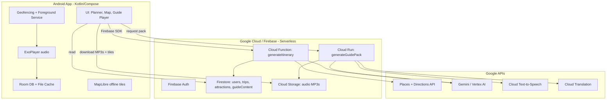
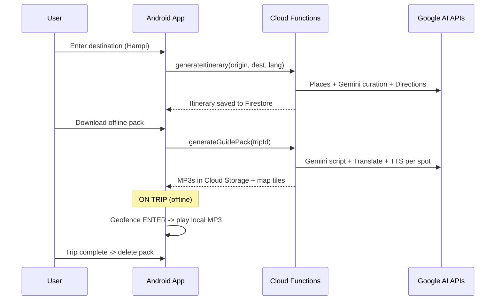

# AI Travel Companion - High-Level Development Plan

A global, AI-powered "automatic tour guide" Android app. Users enter a destination, get an AI-curated itinerary, download an offline pack (map + multilingual audio), and on the trip the app narrates each attraction automatically as they approach it.

## Core Architectural Principles

1. **Pre-generate, don't compute live.** All AI/TTS work happens online before the trip; on the trip the app only plays local files. Solves offline + latency + cost.
2. **Ground content in real data (RAG).** Gemini curates/writes from Places + Wikipedia facts, never invents attractions. Avoids hallucination + licensing issues.
3. **Cache content globally, share across users.** A given attraction's guide is generated once and reused for every user. Marginal cost per user trends to zero.
4. **Serverless only.** No servers to manage; Android dev writes Kotlin + a few small Cloud Functions.

## System Architecture

## Trip Lifecycle (data flow)

## Tech Stack

- **Client:** Kotlin, Jetpack Compose, Material 3, MVVM + Clean Architecture, Room, DataStore, WorkManager (downloads), Foreground Service (geofencing), MapLibre Android SDK (offline maps), Media3/ExoPlayer (audio), Firebase SDK, Coil (images).
- **Backend (serverless):** Firebase Auth, Cloud Firestore, Cloud Storage, Cloud Functions (itinerary), Cloud Run (heavier guide-pack generation to avoid timeouts), Firebase Cloud Messaging.
- **AI / Google APIs:** Gemini (Vertex AI), Cloud Text-to-Speech, Cloud Translation, Google Maps Platform (Places, Directions), Wikipedia/Wikivoyage as RAG source.

## UI Design Direction

Reference blend: **Airbnb** (clean white cards, large rounded corners, photography-forward, generous whitespace) + **Polarsteps** (trip timeline) + **Google Maps** (map interaction patterns).

- Material 3 dynamic color, rounded 16-20dp cards, bold display typography, hero imagery per attraction.
- Key screens: Onboarding/Auth, Home/Search (destination entry), Itinerary (timeline + map preview), Offline-pack download (progress + storage estimate), Map/Navigation (full-screen MapLibre with route + spot markers), Guide Player (now-playing card, transcript, language selector), Trip summary + cleanup.

## Backend Pieces (the only "backend code")

- `generateItinerary(origin, destination, language)` - Cloud Function (`https.onCall`): Places nearby search -> Gemini curation/ordering -> Directions optimize -> write `trips/{id}` + `attractions[]` to Firestore.
- `generateGuidePack(tripId)` - Cloud Run job: per attraction -> check cache in `attractions/{poiId}/guideContent/{lang}`; if missing, Wikipedia fetch -> Gemini script -> Translate -> TTS -> MP3 to Cloud Storage -> cache. Returns signed URLs.
- Firestore model: `users`, `trips`, `attractions` (global shared cache keyed by POI id), `guideContent` (per attraction per language).

## Phased Roadmap

- **Phase 0 - Validation:** Manually build one Hampi experience, test the "audio triggers as I approach" UX with real travelers.
- **Phase 1 - MVP (single region, Android, English):** Auth, itinerary generation, offline pack download, geofence-triggered local audio, manual play fallback, MapLibre offline map, trip cleanup.
- **Phase 2 - Multilingual + polish:** TTS in 3-5 languages, OEM background-service hardening (Xiaomi/Samsung/Oppo), storage lifecycle UI, professional UI pass.
- **Phase 3 - Global scale + monetization:** Auto-generate content for any destination, server-side shared cache, freemium / destination packs / subscription, analytics.
- **Phase 4 - Moat:** Personalization (history vs food vs architecture), reviews/community, B2B white-label, iOS.

## Key Challenges and Mitigations

- **Background location killed by OEMs** -> Foreground service + persistent notification + battery-optimization exemption prompt; test on real devices.
- **No connectivity at remote sites** -> Pre-download everything (non-negotiable).
- **LLM hallucination** -> RAG grounding + show sources.
- **Cloud Function timeout on multi-spot/multi-language packs** -> Cloud Run + per-spot parallel jobs.
- **Cost** -> Global shared content cache; Maps free credit; cheap Gemini Flash tier.
- **Play Store background-location review** -> Clear justification + privacy policy; GDPR/CCPA/India DPDP consent flows.
- **Google Maps weak offline** -> MapLibre hybrid for tiles only, Google for Places/Directions.

## Decisions To Confirm

- Maps: MapLibre hybrid (assumed) vs pure Google Maps (simpler, weaker offline).
- Pilot region for MVP (assumed Hampi).
- Whether to use Cloud Run for guide-pack generation (assumed yes) vs chained Cloud Functions.